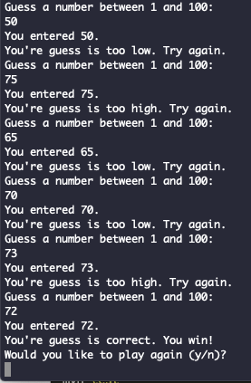

# HiLo

Simple java guessing game using random numbers.

## Pre-requisites

- Java
- Visual Studio Code
- Git

## Setup

- Install vscode
- Install the [recommended extensions](https://code.visualstudio.com/docs/languages/java)
- Install Maven for Java
- Clone the repository
- Open in vscode
- Run in integrated terminal

## Demo

## References

- [Learn Java The Easy Way](https://www.amazon.com/Learn-Java-Easy-Way-Hands-ebook/dp/B0713P1RBH)
- [Maven – How to create a Java project](https://www.mkyong.com/maven/how-to-create-a-java-project-with-maven/)
- [Java in Visual Studio Code](https://code.visualstudio.com/docs/languages/java)
